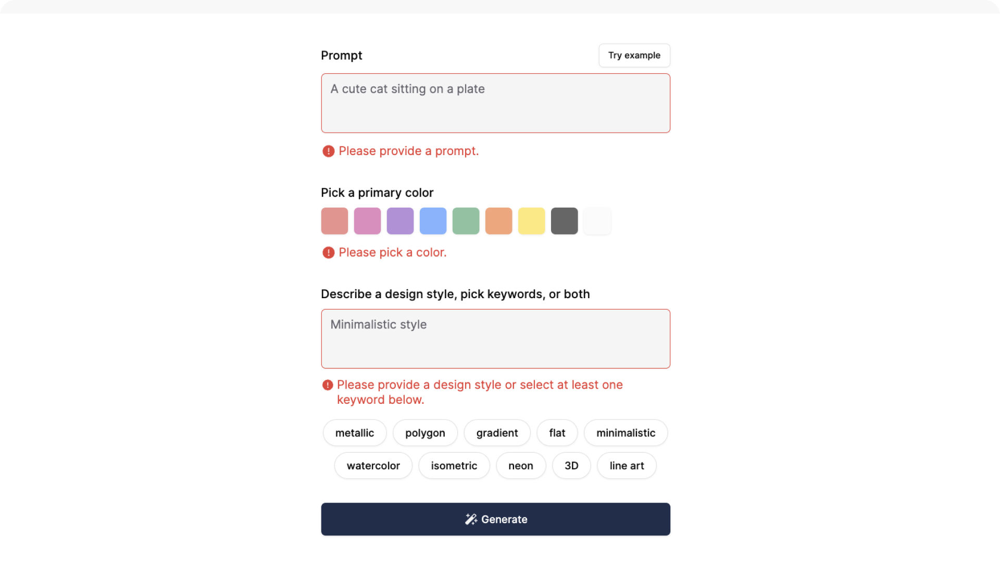

<br/>


<div align="center">
  <a href="https://github.com/adam-ridhwan/pixel-craft">
    
  </a>

  <h1 align="center">PixelCraft</h1>
  <h3>An awesome image generator platform.</h3>
  <p>Note This Project Is Still W.I.P</p>

  <br/>
  <a href="https://pixel-craft-rust.vercel.app/">View Demo</a>
  .
  <a href="https://docs.google.com/forms/d/e/1FAIpQLSdlGTqPyVnAYGZuC0pzYU1J4m9-B0ND2rJSooN6XKXdqQleug/viewform?usp=sf_link">Report Bug</a>
  .
  <a href="https://docs.google.com/forms/d/e/1FAIpQLSedrDUfoSsxrFd7_GMXyM-z_4qlYOX1ujV9x27EGr0T1qHCKw/viewform?usp=sf_link">Request Feature</a>
</div>

<br/>
<br/>


## About The Project

### The Journey
As a creator with a keen interest in generating unique images for websites, I often found myself bogged 
down by the time-consuming process of crafting prompts for AI-based image generation. This challenge 
sparked the interest of creating an app the streamlines the process of prompting. I wanted to create a 
solution that not only streamlines the image creation process but also enhances creativity and 
productivity for users like myself.

### The Technical Edge
Pixelcraft is built on a robust stack, combining the features of server components with Next.js and 
building tools with React with the type safety of TypeScript. The minimal and responsive UI is powered by 
Tailwind CSS, ensuring a seamless user experience. For data handling and validation, I use Zod, and 
our data storage needs are fulfilled by Cloudinary for image hosting and MongoDB for image links.

### The Solution
The main feature of Pixelcraft is its ability to connect seamlessly with OpenAI's API and automating 
prompts for users. By doing so, it not only accesses a powerful engine for image generation but also they 
have access to a curated selection of predefined prompts, tailored to generate a wide range of 
images with just a few clicks.

### The Value 
Pixelcraft revolutionizes the way you create images. There is no need to think too hard about what image 
you want to generate. Now, you can generate diverse, high-quality images in a fraction of the time, 
empowering your creative process and enhancing your projects with visually striking content. Whether 
you're designing a platform for rapid, effortless image generation.

## Built With
- Next.js
- OpenAI api
- React
- TypeScript
- Zod
- MongoDB
- Cloudinary

## Usage
Below are some screenshots of how the images are generated.

### 1) Entering prompt
Users are provided with a **prompt input**, **color selection**, **style input** and **keyword selection**.
They can also click on the `Try example` button to generate a random prompt.
<br/>

<div style="padding-left: 30px; padding-right: 30px;"> 
  
</div>

<br/>
<br/>

### 2) Error handling
All fields are required so that we can ge the most accurate image we want to generate. Using zod to
validate all the input and buttons to make sure that they are all not empty.
<br/>

<div style="padding-left: 30px; padding-right: 30px;"> 
  
</div>

<br/>
<br/>

### 3) Image generation
Once the inputs are entered and buttons are selected, the information given is then crafted into a
customized text prompt to get the most accurate result. The information if sent over to `Dall-E OpenAI api`
and we retrieve back the generated image.
<br/>

<div style="padding-left: 30px; padding-right: 30px;"> 
  
</div>

<br/>
<br/>

### 4) Publishing to community
Publishing to community requires you to enter your name. The image is upload to `Cloudinary`. Once
uploaded, the response we get from `Cloudinary` is a URL to points to the image. We then store the URL
into a MongoDB database along with other information such as `name`, `prompt`, `revised_prompt`. `Revised
prompt` is a prompt that is adjusted by `OpenAI`. The image is then posted onto the `Community` page.
<br/>

<div style="padding-left: 30px; padding-right: 30px;"> 
  
</div>

<br/>

## Roadmap
- [x] ~~Create prompt page~~
- [x] ~~Create community page~~
- [ ] ~~Create collections page~~
  - [ ] Create database for storing user's generated images
- [x] ~~Authentication using NextAuth with Google provider~~
- [ ] Only limit 2 generated image for free trial
- [ ] Make a `Buy credits` feature using `Stripe`. Wanna make a SAAS

## Getting Started
To get started, you need to get your own api keys from mongodb, openai, nextauth, cloudinary and google.


### Installation
1. Get a free API Key at mongodb, openai, nextauth, cloudinary and google

2. Clone the repo

```sh
git clone https://github.com/adam-ridhwan/pixel-craft.git
```

3. Install NPM packages

```sh
npm install
```

4. Enter your API in `.env`

```env
API_KEY = 'ENTER YOUR API';
```


## Contributing
Contributions are what make the open source community such an amazing place to be learn, inspire, and create. Any contributions you make are **greatly appreciated**.
* If you have suggestions for adding or removing features, feel free to contact me to discuss it, or 
  directly create a pull request after you edit the *README.md* file with necessary changes.
* Please make sure you check your spelling and grammar.
* Create individual PR for each suggestion.


### Creating A Pull Request

1. Fork the Project
2. Create your Feature Branch (`git checkout -b feature/AmazingFeature`)
3. Commit your Changes (`git commit -m 'Add some AmazingFeature'`)
4. Push to the Branch (`git push origin feature/AmazingFeature`)
5. Open a Pull Request


## Authors
* **Adam Ridhwan** - *Fullstack Engineer* - [Adam Ridhwan](https://github.com/adam-ridhwan) - *Creator of PixelCraft*
